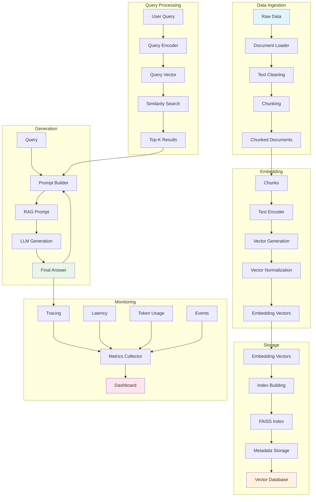
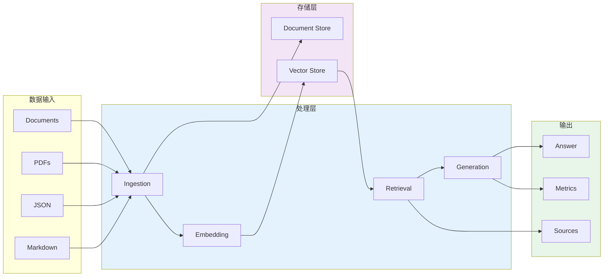
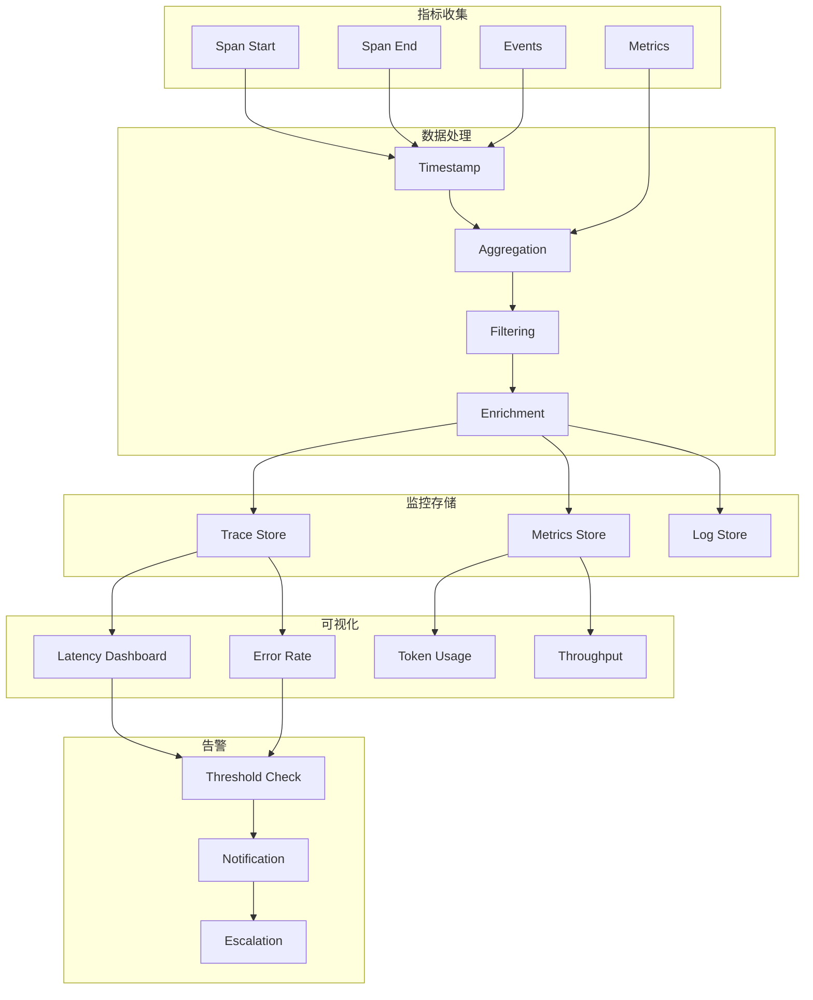
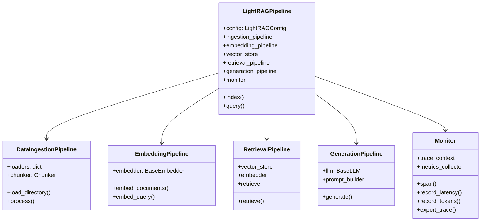
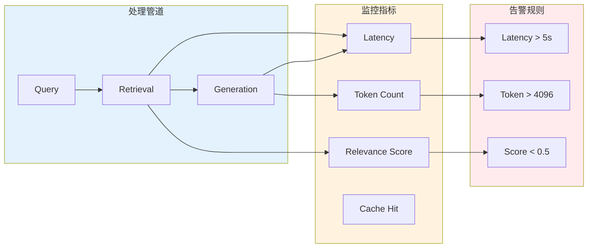
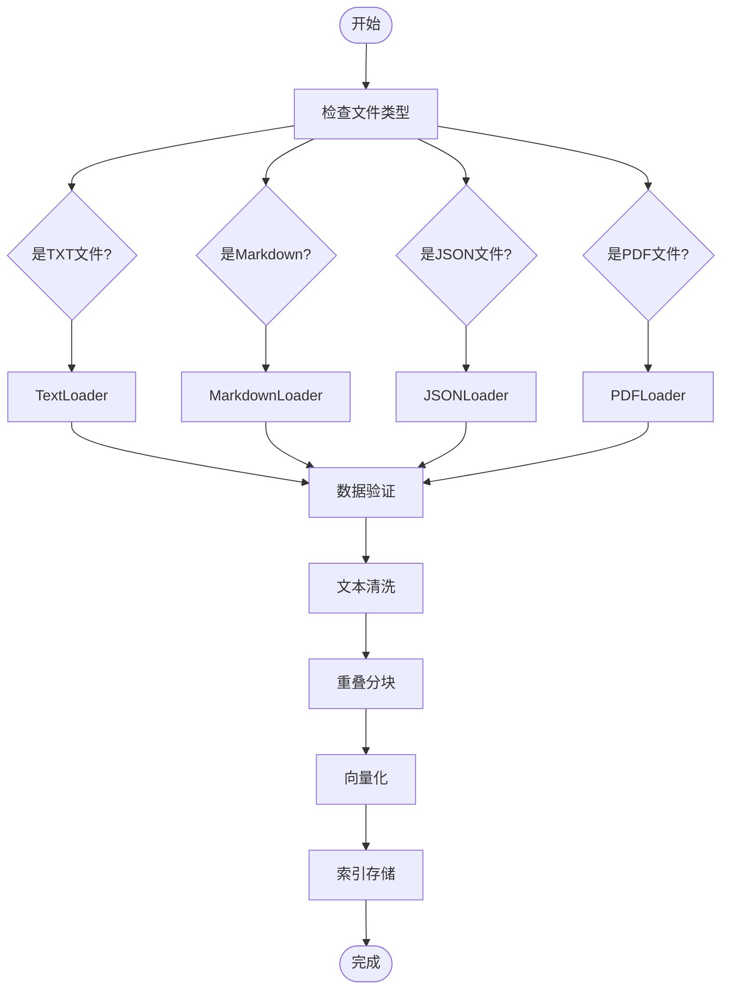

# LightRAG Architecture Flowchart

## Complete Pipeline Flow

```mermaid
flowchart TD
    subgraph Data Ingestion
        A1[Raw Data] --> A2[Document Loader]
        A2 --> A3[Text Cleaning]
        A3 --> A4[Chunking]
        A4 --> A5[Chunked Documents]
    end

    subgraph Embedding
        B1[Chunks] --> B2[Text Encoder]
        B2 --> B3[Vector Generation]
        B3 --> B4[Vector Normalization]
        B4 --> B5[Embedding Vectors]
    end

    subgraph Storage
        C1[Embedding Vectors] --> C2[Index Building]
        C2 --> C3[FAISS Index]
        C3 --> C4[Metadata Storage]
        C4 --> C5[Vector Database]
    end

    subgraph Query Processing
        D1[User Query] --> D2[Query Encoder]
        D2 --> D3[Query Vector]
        D3 --> D4[Similarity Search]
        D4 --> D5[Top-K Results]
    end

    subgraph Generation
        E1[Query] --> E2[Prompt Builder]
        E5[Top-K Results] --> E2
        E2 --> E3[RAG Prompt]
        E3 --> E4[LLM Generation]
        E4 --> E5[Final Answer]
    end

    subgraph Monitoring
        F1[Tracing] --> F5[Metrics Collector]
        F2[Latency] --> F5
        F3[Token Usage] --> F5
        F4[Events] --> F5
        F5 --> F6[Dashboard]
    end

    A5 --> B1
    B5 --> C1
    D5 --> E2
    E5 --> F1

    style A1 fill:#e1f5fe
    style C5 fill:#fff3e0
    style E5 fill:#e8f5e9
    style F6 fill:#fce4ec
```

## Data Flow Diagram

```mermaid
flowchart LR
    subgraph Input["数据输入"]
        I1[Documents]
        I2[PDFs]
        I3[JSON]
        I4[Markdown]
    end

    subgraph Process["处理层"]
        P1[Ingestion]
        P2[Embedding]
        P3[Retrieval]
        P4[Generation]
    end

    subgraph Storage["存储层"]
        S1[Vector Store]
        S2[Document Store]
    end

    subgraph Output["输出"]
        O1[Answer]
        O2[Sources]
        O3[Metrics]
    end

    I1 --> P1
    I2 --> P1
    I3 --> P1
    I4 --> P1

    P1 --> S2
    P1 --> P2
    P2 --> S1
    S1 --> P3
    P3 --> P4
    P4 --> O1
    P3 --> O2
    P4 --> O3

    style Process fill:#e3f2fd
    style Storage fill:#f3e5f5
    style Output fill:#e8f5e9
```

## Monitoring Chain

```mermaid
flowchart TD
    subgraph Collection["指标收集"]
        C1[Span Start]
        C2[Span End]
        C3[Events]
        C4[Metrics]
    end

    subgraph Processing["数据处理"]
        P1[Timestamp]
        P2[Aggregation]
        P3[Filtering]
        P4[Enrichment]
    end

    subgraph Storage["监控存储"]
        S1[Trace Store]
        S2[Metrics Store]
        S3[Log Store]
    end

    subgraph Visualization["可视化"]
        V1[Latency Dashboard]
        V2[Token Usage]
        V3[Error Rate]
        V4[Throughput]
    end

    subgraph Alerting["告警"]
        A1[Threshold Check]
        A2[Notification]
        A3[Escalation]
    end

    C1 --> P1
    C2 --> P1
    C3 --> P1
    C4 --> P2
    P1 --> P2
    P2 --> P3
    P3 --> P4
    P4 --> S1
    P4 --> S2
    P4 --> S3
    S1 --> V1
    S2 --> V2
    S1 --> V3
    S2 --> V4
    V1 --> A1
    V3 --> A1
    A1 --> A2
    A2 --> A3
```

## Component Architecture

```mermaid
classDiagram
    class LightRAGPipeline {
        +config: LightRAGConfig
        +ingestion_pipeline
        +embedding_pipeline
        +vector_store
        +retrieval_pipeline
        +generation_pipeline
        +monitor
        +index()
        +query()
    }

    class DataIngestionPipeline {
        +loaders: dict
        +chunker: Chunker
        +load_directory()
        +process()
    }

    class EmbeddingPipeline {
        +embedder: BaseEmbedder
        +embed_documents()
        +embed_query()
    }

    class RetrievalPipeline {
        +vector_store
        +embedder
        +retriever
        +retrieve()
    }

    class GenerationPipeline {
        +llm: BaseLLM
        +prompt_builder
        +generate()
    }

    class Monitor {
        +trace_context
        +metrics_collector
        +span()
        +record_latency()
        +record_tokens()
        +export_trace()
    }

    LightRAGPipeline --> DataIngestionPipeline
    LightRAGPipeline --> EmbeddingPipeline
    LightRAGPipeline --> RetrievalPipeline
    LightRAGPipeline --> GenerationPipeline
    LightRAGPipeline --> Monitor
```

## Performance Metrics Chain

```mermaid
flowchart LR
    subgraph Pipeline["处理管道"]
        Q[Query] --> R[Retrieval]
        R --> G[Generation]
    end

    subgraph Metrics["监控指标"]
        M1[Latency]
        M2[Token Count]
        M3[Relevance Score]
        M4[Cache Hit]
    end

    subgraph Alerts["告警规则"]
        A1[Latency > 5s]
        A2[Token > 4096]
        A3[Score < 0.5]
    end

    R --> M1
    R --> M3
    G --> M1
    G --> M2
    M1 --> A1
    M2 --> A2
    M3 --> A3

    style Pipeline fill:#e3f2fd
    style Metrics fill:#fff3e0
    style Alerts fill:#ffebee
```

## File Processing Flow

```mermaid
flowchart TD
    Start([开始]) --> Check[检查文件类型]

    Check --> TXT{是TXT文件?}
    Check --> MD{是Markdown?}
    Check --> JSON{是JSON文件?}
    Check --> PDF{是PDF文件?}

    TXT --> LoadTXT[TextLoader]
    MD --> LoadMD[MarkdownLoader]
    JSON --> LoadJSON[JSONLoader]
    PDF --> LoadPDF[PDFLoader]

    LoadTXT --> Validate[数据验证]
    LoadMD --> Validate
    LoadJSON --> Validate
    LoadPDF --> Validate

    Validate --> Clean[文本清洗]
    Clean --> Chunk[重叠分块]
    Chunk --> Embed[向量化]
    Embed --> Index[索引存储]
    Index --> End([完成])
```
