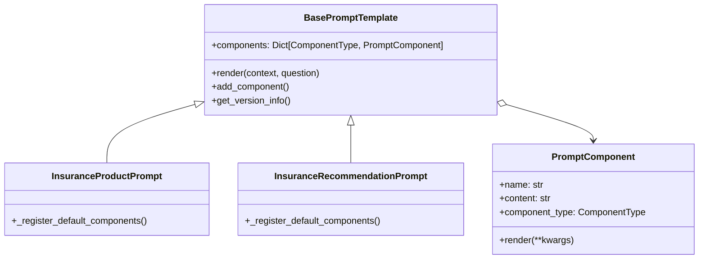
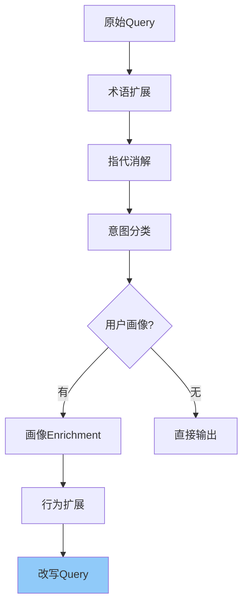
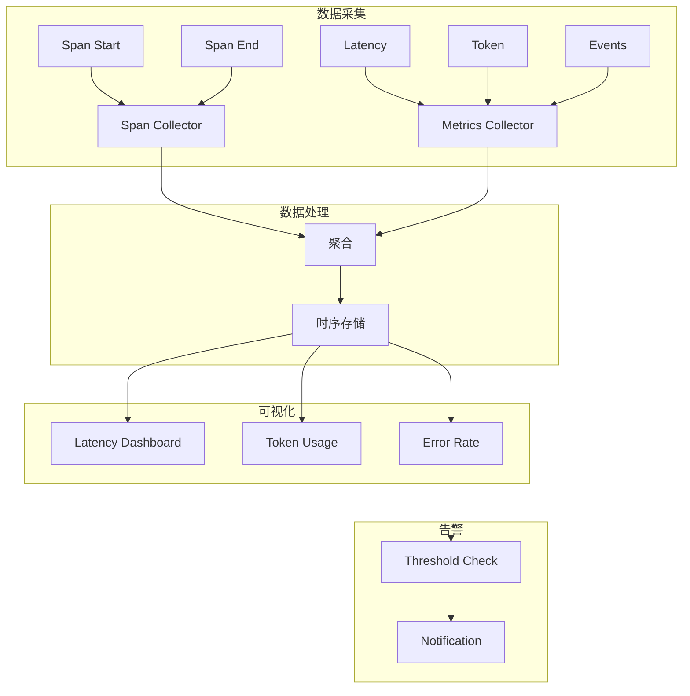
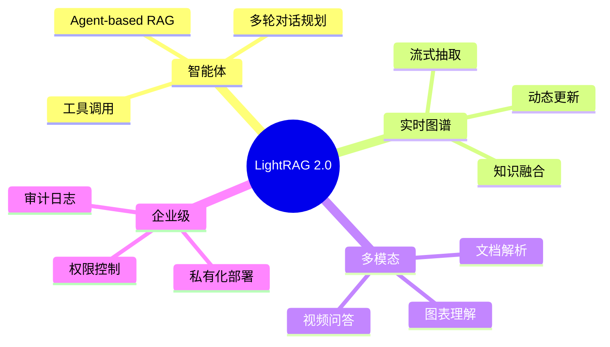

# LightRAG 技术亮点分析报告

## 一、项目概述

LightRAG 是一个轻量级、模块化的 RAG（检索增强生成）框架，专为保险问答场景设计，集成知识图谱增强能力。

```
┌─────────────────────────────────────────────────────────────────────────┐
│                           LightRAG 技术架构                              │
├─────────────────────────────────────────────────────────────────────────┤
│                                                                         │
│  ┌──────────────┐    ┌──────────────┐    ┌──────────────┐              │
│  │ Query Rewrite │───▶│  Retrieval   │───▶│  Generation  │              │
│  │  (用户画像+历史)  │    │  (向量+图谱)   │    │  (专业Prompt) │              │
│  └──────────────┘    └──────────────┘    └──────────────┘              │
│         │                    │                    │                      │
│         ▼                    ▼                    ▼                      │
│  ┌──────────────────────────────────────────────────────┐              │
│  │              Monitoring & Tracing                    │              │
│  │              (全链路监控)                              │              │
│  └──────────────────────────────────────────────────────┘              │
│                                                                         │
└─────────────────────────────────────────────────────────────────────────┘
```

---

## 二、核心技术亮点

### 1. 专业 Prompt 模板系统

#### 技术对比

| 维度 | 传统方式 | LightRAG 方案 |
|------|----------|---------------|
| Prompt结构 | 单一大字符串 | 组件化（Persona+System+Constraint+Output） |
| 迭代方式 | 修改整个Prompt | 单独替换组件 |
| 版本控制 | 无 | 支持版本管理、A/B测试 |
| 领域适配 | 通用模板 | 预置保险领域模板 |

#### 架构设计



#### 亮点分析

1. **组件化解耦**：8种组件类型（Persona、System、Constraint、OutputFormat等），每个组件独立版本控制
2. **动态组合**：运行时根据场景动态选择和组合组件
3. **保险领域预置**：
   - `InsuranceProductPrompt` - 产品咨询
   - `InsuranceClaimPrompt` - 理赔指导
   - `InsuranceComparisonPrompt` - 产品对比
   - `InsuranceRecommendationPrompt` - 产品推荐

---

### 2. 知识图谱增强召回

#### 技术对比

| 维度 | 传统向量检索 | LightRAG 混合检索 |
|------|-------------|-------------------|
| 召回逻辑 | 纯相似度匹配 | 向量相似度 + 实体关系推理 |
| 上下文理解 | 文本匹配 | 实体链接 + 多跳推理 |
| 推理能力 | 无 | 支持2跳关系推理 |
| 保险术语 | 无法处理缩写 | 实体对齐（"重疾"→"重大疾病保险"） |

#### 技术实现

```mermaid
flowchart LR
    subgraph 知识图谱层
        E1[实体: 平安福] --> R1[PRODUCED_BY]
        R1 --> E2[实体: 平安保险]
        E1 --> R2[IS_A]
        R2 --> E3[实体: 重疾险]
    end

    subgraph 检索层
        Q[用户Query] --> EQ[实体抽取]
        EQ -->|抽取"平安福"| GR[图谱检索]
        GR -->|邻居: 平安保险| RC[上下文补充]
        RC --> FR[最终结果]
    end

    E1 -.-> GR
```

#### 亮点分析

1. **实体识别**：保险领域实体类型（PRODUCT、COMPANY、CONCEPT、ACTION）
2. **关系抽取**：PRODUCED_BY、IS_A、RELATED_TO 等关系类型
3. **多跳推理**：BFS算法实现2跳邻居发现
4. **混合检索**：图谱结果(30%) + 向量结果(70%) 融合

---

### 3. 智能 Query 改写

#### 技术对比

| 维度 | 传统方式 | LightRAG Query改写 |
|------|----------|-------------------|
| 用户画像 | 无 | 年龄、收入、险种历史、风险偏好 |
| 会话历史 | 无 | 指代消解（"它"→"重疾险"） |
| 用户行为 | 无 | 浏览、点击、搜索行为追踪 |
| 术语扩展 | 无 | "重疾"→"重大疾病保险" |

#### 改写流程



#### 亮点分析

1. **上下文感知**：利用会话历史进行指代消解
2. **个性化**：基于用户画像动态调整Query
3. **行为驱动**：根据浏览历史扩展查询意图
4. **保险术语**：自动扩展缩写和同义词

---

### 4. 全链路监控体系

#### 技术对比

| 维度 | 传统日志 | LightRAG 监控体系 |
|------|----------|-------------------|
| 追踪粒度 | 函数级 | Span级（分布式追踪） |
| 指标类型 | 基础日志 | 延迟、Token、检索数等多维指标 |
| 可观测性 | 日志查询 | Tracing + Metrics + Events |
| 性能分析 | 手动分析 | 自动聚合、趋势分析 |

#### 监控架构



#### 亮点分析

1. **Span追踪**：每个操作自动记录start/end时间
2. **多维指标**：延迟、Token、检索数、成功率
3. **事件记录**：自定义事件日志
4. **告警支持**：阈值检测和通知

---

## 三、与传统技术路线对比总结

### 模块对比表

| 模块 | 传统方式 | LightRAG 方案 | 亮点 |
|------|----------|---------------|------|
| **数据摄入** | 简单分块 | 重叠分块 + 多格式支持 | 支持PDF/JSON/MD/TXT |
| **向量化** | 单一模型 | 可切换本地/API | 支持Sentence-Transformers + OpenAI |
| **向量存储** | 基础FAISS | FAISS + 内存双模式 | 灵活选择 |
| **检索** | 纯向量 | 向量 + BM25 + 图谱 | 三路召回融合 |
| **生成** | 硬编码Prompt | 组件化模板 | 动态组合、版本管理 |
| **Query处理** | 直出 | 用户画像 + 上下文改写 | 个性化Query |
| **监控** | 基础日志 | Span追踪 + 多维指标 | 全链路可观测 |

### 架构优势

```
传统架构                          LightRAG架构
─────────                        ────────────
┌─────────────┐                 ┌─────────────────────┐
│  简单分块   │                 │  智能Query改写      │
└──────┬──────┘                 └──────────┬──────────┘
       │                               │
┌──────▼──────┐                 ┌───────▼───────┐
│  单一Embedding│              │ 混合检索       │
└──────┬──────┘                 │(向量+BM25+图谱)│
       │                        └───────┬───────┘
┌──────▼──────┐                        │
│  向量检索   │                 ┌───────▼───────┐
└──────┬──────┘                 │  专业Prompt    │
       │                        │  模板系统       │
┌──────▼──────┐                 └───────┬───────┘
│  硬编码Prompt│                        │
└──────┬──────┘                 ┌───────▼───────┐
       │                        │  全链路监控     │
┌──────▼──────┐                 └───────────────┘
│  基础日志   │
└─────────────┘
```

---

## 四、改进空间与未来方向

### 1. 短期改进

| 优先级 | 改进项 | 具体内容 | 预期效果 |
|--------|--------|----------|----------|
| 🔴 高 | 实体抽取增强 | 引入NER模型替代规则匹配 | 提升实体召回率 |
| 🔴 高 | 图谱持久化 | 集成Neo4j替代内存存储 | 支持大规模图谱 |
| 🟡 中 | Prompt版本UI | 开发Web界面管理模板 | 提升迭代效率 |
| 🟡 中 | 缓存优化 | 引入Redis缓存Query结果 | 降低延迟 |

### 2. 中期规划

| 方向 | 改进项 | 技术方案 |
|------|--------|----------|
| **多模态** | 图文理解 | 集成CLIP/ViT模型 |
| **图谱增强** | 动态更新 | 增量实体/关系抽取 |
| **个性化** | 用户embedding | 用户-物品协同过滤 |
| **评估体系** | 召回/生成评估 | RAGAS指标集成 |

### 3. 长期愿景



---

## 五、技术选型建议

### 当前技术栈

| 组件 | 选型 | 理由 |
|------|------|------|
| Embedding | Sentence-Transformers | 开源、本地部署、效果稳定 |
| Vector Store | FAISS | 高效、成熟、内存模式友好 |
| LLM | OpenAI兼容API | 灵活切换本地/云端 |
| 图存储 | 内存+文件 | 轻量级、便于演示 |

### 规模化建议

| 规模 | 图存储 | 向量库 | LLM |
|------|--------|--------|-----|
| 小规模(<10万文档) | 内存 | FAISS | 本地7B模型 |
| 中规模(10-100万) | Neo4j | Milvus/Qdrant | API+本地 |
| 大规模(>100万) | 图数据库 | 云服务(Elasticsearch) | 混合部署 |

---

## 六、总结

### LightRAG 三大核心亮点

1. **专业Prompt模板系统**
   - 组件化解耦，支持动态组合
   - 保险领域预置模板，开箱即用

2. **知识图谱增强召回**
   - 实体关系推理，补充语义理解
   - 混合检索提升召回质量

3. **全链路可观测**
   - Span级追踪，性能问题快速定位
   - 多维指标，支持A/B测试

### 改进优先级

```
立即实施 ────────────────────────────────────────► 长期规划
┌─────────┐   ┌─────────┐   ┌─────────┐   ┌─────────────┐
│ NER模型 │   │图持久化 │   │缓存优化 │   │ 多模态理解  │
│ 集成    │   │Neo4j   │   │Redis   │   │ Agent-based │
└─────────┘   └─────────┘   └─────────┘   └─────────────┘
```

---

*文档生成时间: 2025-02-03*
*版本: v1.0*
